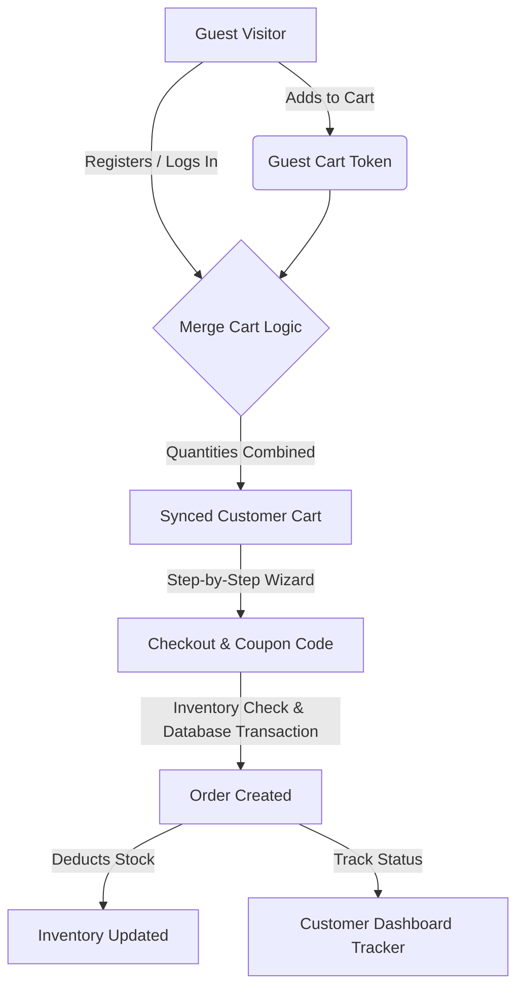

# E-Sphere | Next-Gen E-commerce Store (Laravel + React SPA)

E-Sphere is a state-of-the-art, premium full-stack e-commerce application built using **Laravel 11** for the REST API backend and **ReactJS (Vite)** for the single-page application (SPA) frontend. 

It is designed with a premium, glassmorphic dark-theme design system using **Tailwind CSS v4** and includes a complete administration suite, customer portal, guest-session cart syncing, order tracking, and interactive analytics.

---

## 🛠 Technology Stack

### Backend (REST API)
* **Core Framework**: Laravel 11 (PHP 8.2+)
* **Authentication**: Laravel Sanctum (Token-based SPA authorization)
* **Roles & Permissions**: Spatie Laravel-Permission v6 (Admin vs. Customer scopes)
* **CORS Management**: Configured for local cross-origin Vite API requests
* **Database**: MySQL / MariaDB (Port: `3307` default configuration)

### Frontend (Single Page Application)
* **Build Tool**: Vite + React
* **State Management**: Redux Toolkit (Session caching, cart actions, profile details)
* **Styling**: Tailwind CSS v4 (Glassmorphic panels, neon borders, Outfit Google Font)
* **Interactive Charts**: Recharts (Sales visualization)
* **Icons**: Lucide React

---

## 💎 Key Features (Deep Dive)



### 1. User Authentication & Profile Settings
* **Sanctum Authentication**: Secure registration and token-based login.
* **Profile Management**: Customers can update their details, upload custom profile pictures, and change their passwords securely.
* **Address Book CRUD**: Multi-address saver (Billing vs. Shipping). Customers can set a default address to accelerate the checkout process.

### 2. Interactive Product Catalog
* **Dynamic Search & Filtering**: Live search with sidebar filters based on Categories, Brands, Ratings, and Price Ranges.
* **Catalog Sorting**: Sort products by price (low to high, high to low), average rating, and newest arrivals.
* **Product Detail Gallery**: Multiple image upload support with a clean thumbnail selector.
* **Dynamic Variant Engine**: Add customizable options like Size, Color, or Storage. Each option can have price modifiers (e.g. +$100 for 256GB) and its own inventory counts.
* **Customer Review Loop**: Validated user reviews submit form. Reviews go into a moderation queue and appear on product pages once approved by an Admin.

### 3. Smart Cart & Order Checkout
* **Guest Cart Memory**: Guest cart matches a temporary token stored in the browser's LocalStorage.
* **Cart Merging Logic**: Once the guest logs in, a backend algorithm automatically merges the guest cart items with the customer's permanent database cart (capping quantities based on current warehouse stock).
* **Step-by-Step Checkout Wizard**:
  1. *Shipping Address*: Choose from saved addresses or create a new one instantly.
  2. *Coupons*: Apply promo codes (e.g., `WELCOME10` for 10% off, `FLAT50` for $50 off) with minimum purchase limit validation checks.
  3. *Payment*: Mock inputs for Cards, UPI, or select Cash on Delivery.
  4. *Final Summary*: Transparent billing displaying subtotal, coupon savings, tax calculations, shipping fees, and grand total.
* **Atomic Transactions**: Orders are saved using DB transactions; if a step fails or stock runs out, changes rollback automatically.

### 4. Interactive Order Status Stepper
* **Live Stepper**: Customers see a visual progress line indicating their order status:
  `Placed (Pending)` ➔ `Confirmed (Processing)` ➔ `Shipped` ➔ `Delivered`
* **Cancellation Option**: Customers can cancel orders that are still *Pending* or *Processing*. Cancelling automatically restores the product/variant inventory stock counts.

### 5. Super Admin Console Panel
* **Analytics Dashboard**: 
  - Summary KPI cards (Revenue, Orders, Customers, Low-Stock items).
  - 7-Day sales area trend graph built dynamically using **Recharts**.
  - List of recent orders and low-stock warnings.
* **Product Catalog CRUD**: Manage items, upload pictures, set specifications, and build custom product variants.
* **Bulk Importer**: Upload a standard `.csv` file to import hundreds of products into the database instantly.
* **Category & Brand Manager**: Full CRUD tools supporting hierarchical parent-child category trees and banner image uploads.
* **Order Logistics Dispatch**: View all customer orders, filter by status, and update payment or delivery stages.
* **Review Moderation Hub**: Approve or delete pending reviews before they show up on the storefront.
* **Customer Block/Unblock List**: Active/blocked toggle to prevent malicious users from placing orders.

### 6. AI-Powered Chatbot Assistant
* **Database-Grounded Product Recommendation**: Uses Google Gemini's model to search database items and recommend relevant products, providing direct routing links (`/product/slug`) inside the SPA.
* **Intelligent Customer Support**: Answers policies, FAQs, and helps authenticated users retrieve and track their live order statuses.
* **Premium Floating Chat Widget**: Implemented with dynamic toggle animations, suggestion prompts, and glassmorphic aesthetics.

---

## 📂 Project Architecture

```
ecom/
├── backend/                  # Laravel 11 REST API Project
│   ├── app/
│   │   ├── Http/Controllers/Api/   # API Controllers (Auth, Cart, Checkout, Admin)
│   │   └── Models/                 # Eloquent Models (User, Product, Order, Address)
│   ├── config/                     # Configuration (CORS, Sanctum, Mail)
│   ├── database/
│   │   ├── migrations/             # Database Schemas & Relationships
│   │   └── seeders/                # Database Seeders for testing
│   └── routes/
│       └── api.php                 # Endpoint route definitions
│
├── frontend/                 # React JS (Vite) SPA Project
│   ├── src/
│   │   ├── components/             # Reusable UI components (Navbar, Footer, ProductCard)
│   │   ├── pages/                  # Page layouts (Home, Catalog, Detail, Admin, Dashboard)
│   │   ├── store/                  # Redux Slices (Auth, Cart)
│   │   └── utils/                  # Axios configurations and token interceptors
│   ├── vite.config.js              # Vite configuration (with Tailwind CSS v4)
│   └── index.html                  # Core index file containing SEO metadata
│
└── README.md                 # Project documentation
```

---

## 🚀 Setup & Installation Guide

### 1. Database Setup
1. Start your XAMPP control panel and verify **Apache** and **MySQL** are running.
2. Ensure MySQL is configured to run on port **`3307`** (or change it in Laravel `.env`).
3. Open your browser and go to **`http://localhost/phpmyadmin`**.
4. Create a new empty database named `ecom_db`.

### 2. Backend Setup (Laravel REST API)
1. Open your terminal and navigate to the backend directory:
   ```bash
   cd backend
   ```
2. Install dependencies:
   ```bash
   composer install
   ```
3. Copy the environment configuration:
   ```bash
   copy .env.example .env
   ```
4. Open the new `.env` file and set your database credentials & Gemini API Key:
   ```env
   DB_CONNECTION=mysql
   DB_HOST=127.0.0.1
   DB_PORT=3307
   DB_DATABASE=ecom_db
   DB_USERNAME=root
   DB_PASSWORD=

   GEMINI_API_KEY=your_google_gemini_api_key_here
   ```
5. Run database migrations and seed the mock data:
   ```bash
   php artisan migrate --seed
   ```
6. Create the symlink for product images storage:
   ```bash
   php artisan storage:link
   ```
7. Start the Laravel serve engine:
   ```bash
   php artisan serve --port=8000
   ```
   *The backend REST API will now be listening on `http://localhost:8000/api`.*

### 3. Frontend Setup (React Vite SPA)
1. Open a new terminal window and navigate to the frontend directory:
   ```bash
   cd frontend
   ```
2. Install npm packages:
   ```bash
   npm install
   ```
3. Launch the Vite server:
   ```bash
   npm run dev
   ```
   *The frontend website will open at `http://localhost:5173`.*

---

## 🔑 Login Accounts for Testing

Once the installation is complete, use the following credentials to login:

### 🛡 Admin Dashboard Access
* **URL**: [http://localhost:5173/login](http://localhost:5173/login)
* **Email**: `admin@ecom.com`
* **Password**: `password`

### 🛒 Customer Storefront Access
* **URL**: [http://localhost:5173/login](http://localhost:5173/login)
* **Email**: `john@example.com`
* **Password**: `password`
